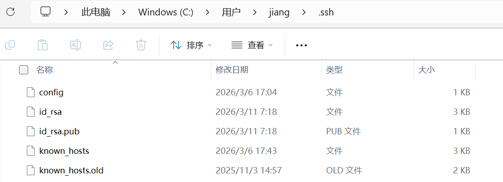
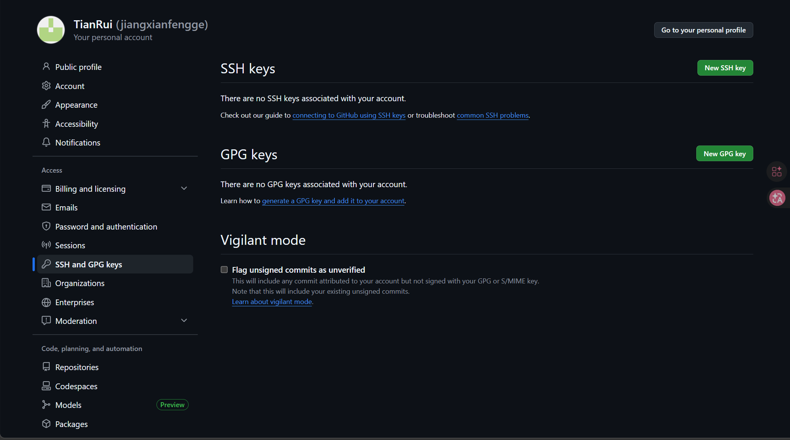
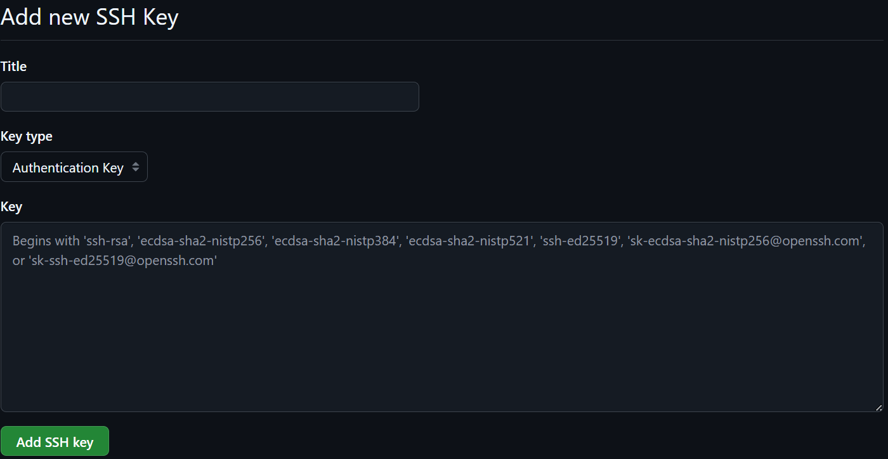
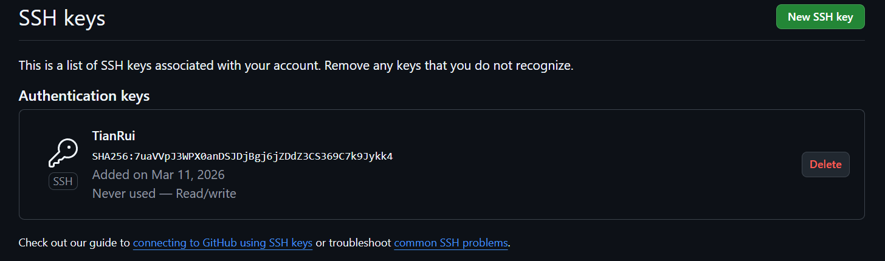
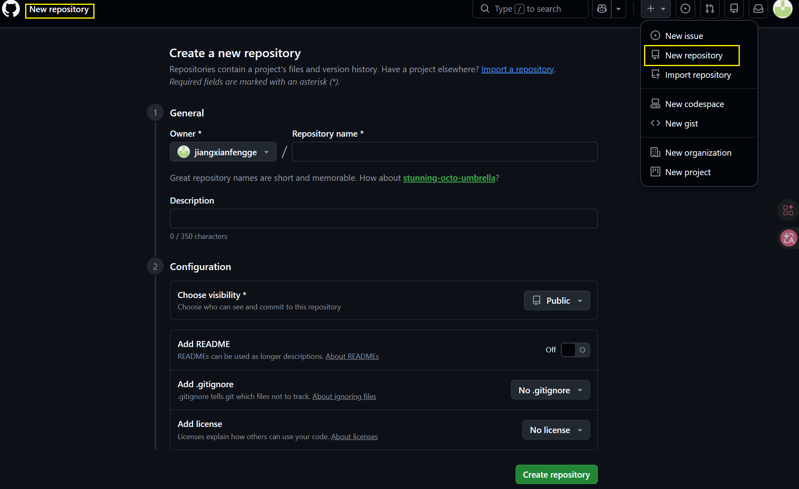

# 一、生成配置SSH：

git客户端安装后，如何和远程仓库连接呢？==使用SSH==。

打开`git bash`。

**用户名：**

```
jiang@▒▒ҷ MINGW64 ~
$ git config --global user.name "jiangxian666"
```

**邮箱：**

```
jiang@ҷ MINGW64 ~
$ git config --global user.email "1093649884@qq.com"
```

**生成SSH（有SSH可以跳过）：**

```
jiang@ҷ MINGW64 ~
$ ssh-keygen -t rsa -C "1093649884@qq.com"
Generating public/private rsa key pair.
Enter file in which to save the key (/c/Users/jiang/.ssh/id_rsa):
Enter passphrase for "/c/Users/jiang/.ssh/id_rsa" (empty for no passphrase):
Enter same passphrase again:
Your identification has been saved in /c/Users/jiang/.ssh/id_rsa
Your public key has been saved in /c/Users/jiang/.ssh/id_rsa.pub
The key fingerprint is:
SHA256:7uaVVpJ3WPX0anDSJDjBgj6jZDdZ3CS369C7k9Jykk4 1093649884@qq.com
The key's randomart image is:
+---[RSA 3072]----+
|       o.++o. . o|
|      . +o=. + oo|
|     . o ...o + o|
|    o B  . o * . |
|   o o +S = + +  |
|    .  . o * o   |
|        Eo*.     |
|       o*o=.     |
|       ++=..     |
+----[SHA256]-----+

```

SSH文件放在`C:/User/用户/.ssh`下，`id_rsa`为私钥，`id_rsa.pub`为公钥。



**github配置SSH：**

打开`id_rsa.pub`文件，全选，复制全文。

```
ssh-rsa AAAAB3NzaC1yc2EAAAADAQABAAABgQD4n3MQCfjYaq5PhVsBGoy+dxMQbogENcyIYwrBI4wxHtIhHQ5jPUzYn2I8BdCDzsuDUPg3YMjkv3Qfvu2XbwU5gWBLl58o7MNMwpHWpUHXWJPQLFr+kGsV7mQJwxJqVlX9GxtBwDEnY31P1elR3bCb/yAFW3y4SNMvwE05KmDIBiqvJ57ZxzjaU72L03Hv4dBGI6ifmyIH29v7FiXGmkdEMgcbOjOvjo8dRPVoEu4mO/hjr+waLmGpv4uz6J0WIeW/YT2iIsAqwaEl40m3jxTVUTI058Op+gOs6a1+cXTrArqgPm+mWi4ohHmz3s9AkHUvgogoNM3K+NPGdh8l8Y12PqybrPcsl2E/i4C7RdoUVUoXIG4CvDjKA0+4hA1JGi9RikhUrFzIDWWom2Nq74dyWkbVnQRAaL16ryAaozybdcXHuQqD7/ZRpipeZd0tfbCCIjlmU3UKFecIJmYeX7b6do2/fIQyuWrg8L7WSqOUJPQGd/E6AwxUGjt0BIbDGwk= 1093649884@qq.com
```

github->账户->setting：





将复制的`key`复制到Key中，Title随意即可。填写完后点击`Add SSH key`。



**测试SSH连接：**

```
ssh -T git@github.com
```

```
jiang@ҷ MINGW64 ~
$ ssh -T git@github.com
The authenticity of host 'github.com (20.205.243.166)' can't be established.
ED25519 key fingerprint is: SHA256:+DiY3wvvV6TuJJhbpZisF/zLDA0zPMSvHdkr4UvCOqU
This key is not known by any other names.
Are you sure you want to continue connecting (yes/no/[fingerprint])? yes
Warning: Permanently added 'github.com' (ED25519) to the list of known hosts.
Hi jiangxianfengge! You've successfully authenticated, but GitHub does not provide shell access.

```

这里的`Hi jiangxianfengge! You've successfully authenticated, but GitHub does not provide shell access.`就是连接成功了，jiangxianfengge是我的github名。


---

# 二、推送文件到远程仓库：

## 1、先定义本地仓库和远程仓库：

### 定义与创建本地仓库：

首先创建一个文件夹（使用本地的**Notebook**）。

让`git bash`进入到该文件中，并执行`git init`命令，将其初始化为一个仓库。

```
jiang@ҷ MINGW64 /d/Notebook
$ git init
Initialized empty Git repository in D:/NoteBook/.git/

```

结束后在文件夹下会出现一个隐藏的文件夹**.git**。


### 创建远程仓库：



创建好后的远程仓库的SSH为：`git@github.com:jiangxianfengge/Self_Study.git`


## 2、推送文件到远程：

1. **建立本地仓库**（已经完成）；
2. 与远程建立连接，测试；
	- `ssh -T git@github.com`
3. `init`命令初始化仓库；
	- `git init`
4. 关联本地仓库和GitHub远程仓库；
	- `git remote add origin git@github.com:jiangxianfengge/Self_Study.git`
	- `origin`是远程仓库的默认别名，要是只使用一个远程仓库就使用`origin`即可。
5. 手动拷贝文件，并执行`add`命令；
	- `git add 文件夹1/ 文件夹2/`
6. `commit`命令；
	- `git commit -m "注释"`
7. `push`命令；
	- `git push -u origin master`


**实际的流程如下：**

==将本地仓库和远程仓库连接：==

`git remote add origin git@github.com:jiangxianfengge/Self_Study.git`

==确认关联是否成功：==

`git remote -v`

有如下的输出，说明关联成功：

```
jiang@ҷ MINGW64 /d/Notebook (master)
$ git remote -v
origin  git@github.com:jiangxianfengge/Self_Study.git (fetch)
origin  git@github.com:jiangxianfengge/Self_Study.git (push)

```

==选择要上传的文件：==

`git add Git学习：/`

```
jiang@▒▒ҷ MINGW64 /d/Notebook (master)
$ git add Git学习：/
```

执行后没有报错说明成功了（Git不会有多余提示）；若提示`fatal: pathspec 'xxx' did not match any files`，说明写的文件夹/文件名不对，需要检查路径是否正确。

==本地提交文件：==

`git commit -m "2026-3-11"`

执行后如果输出类似 `1 file changed, 0 insertions(+), 0 deletions(-)`，说明提交成功；

==推送到GitHub远程仓库：==

`git push -u origin master`

首次推送可能会弹出SSH验证提示，输入`yes`即可；

执行后若输出`Writing objects: 100% (x/x), done.`，说明推送成功！


---

# 三、拉取文件到本地：

语法：`git clone <仓库地址> <目标路径>`。

但是当路径已经存在且非空，那么为了防止覆盖文件，会拒绝克隆操作。

==当我们想要保留已有文件夹里的内容，同时把Git仓库的代码加进去：==

```python
# 第一步：进入目标文件夹
cd D:/Self_Study/大模型学习

# 第二步：初始化 Git 仓库（如果还没初始化）
git init

# 第三步：关联远程仓库
git remote add origin git@github.com:jiangxianfengge/Self_Study.git

# 第四步：拉取仓库代码（如果有冲突会提示，按提示处理）
git pull origin master
# 如果仓库默认分支是 master，就用 git pull origin master
```

## 两台设备之间的同步问题：

当本地文件和仓库中的文件存在修改时，要是直接使用`git pull origin master`，那么会出现以下问题：

```
jiang@ҷ MINGW64 /d/Notebook (master) $ git pull origin master remote: Enumerating objects: 7, done. remote: Counting objects: 100% (7/7), done. remote: Compressing objects: 100% (3/3), done. remote: Total 4 (delta 1), reused 4 (delta 1), pack-reused 0 (from 0) Unpacking objects: 100% (4/4), 929 bytes | 23.00 KiB/s, done. From github.com:jiangxianfengge/Self_Study * branch master -> FETCH_HEAD 61bf58c..3b9ec22 master -> origin/master Updating 61bf58c..3b9ec22 
error: Your local changes to the following files would be overwritten by merge: Git学习：/git学习.md Please commit your changes or stash them before you merge. Aborting
```

`error: Your local changes to the following files would be overwritten by merge: Git学习：/git学习.md Please commit your changes or stash them before you merge. Aborting`

这个错误表示本地的文件存在修改，但是还没有提高，因此在执行`git pull`时，若直接合并远程的更新**会导致本地的修改被覆盖**。Git要求在合并前先处理这些本地的修改。

==有以下几种处理方式：==

### 1、提交本地修改：

若希望保持本地修改，那么就可以将它们先提交到本地仓库，再执行`git pull`合并远程更新：

```Bash
git add .
git commit -m "保存本地修改"
git pull origin master
```


## 2、暂存本地修改（stash）：

若不想立刻提交本地修改，但也希望执行`git pull`来合并远程的更改，可以使用`git stash`命令暂存本地的修改，然后进行拉取：

```bash
git stash
git pull origin master
```

这样，Git会将修改暂存起来，拉取远程更新后，可以恢复暂存的修改：

```bash
git stash pop
```


### 3、放弃本地修改：

若确定不需要保留本地修改，可以通过丢弃本地的修改，直接执行`git pull`：

```bash
git checkout -- <file>
git pull origin master
```

若丢弃所有本地修改，可以用：

```bash
git reset --hard
git pull origin master
```


### 总结：

- 提交本地修改：git add . -> git commit -m "保存本地修改" -> git pull origin master
-  暂存本地修改：git stash -> git pull origin master -> git stash pop
-  放弃本地修改：git reset --hard -> git pull origin master
